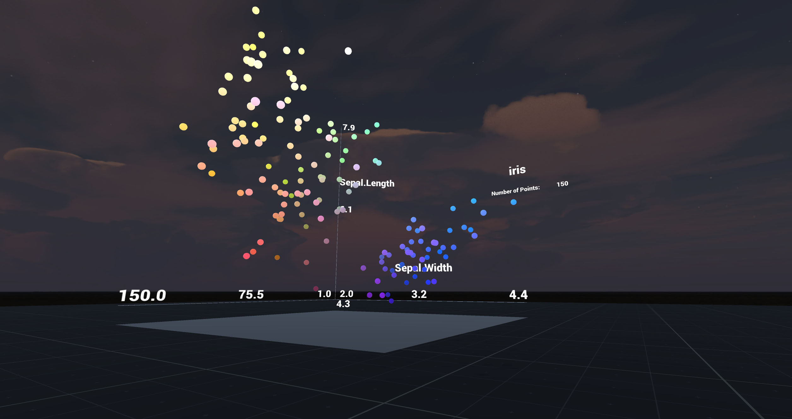

# Scatterplot_Standalone

Generic scatterplot, based off of previous project (https://github.com/PrinzEugn/UnityScatterplot). 

Improvements include:

- Frame (axes) with labels and tick marks
- Labels that update according to data values.
- Points are plotted within 1x1x1 cube, with min/max values adjusted accordingly.
- Points can be plotted as particles or as prefab objects (or both). Color is currently based off of x/y/z values.

For a detailed tutorial on how to being making such a plot from scratch, see here:
http://sites.psu.edu/bdssblog/2017/04/06/basic-data-visualization-in-unity-scatterplot-creation/

Screenshot:

